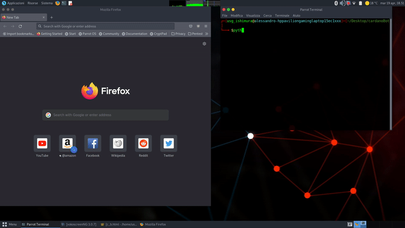

# Cardano Bot
### Background
This project was born for fun, even if I'm skeptical about NFTs the intention was to prove that i could mint and visualize a piece capable of interacting in real-time with Cardano Blockchain data even though [<ins>pool.pm</ins>](https://pool.pm) blocked any API call through the Content Security Policy of Blockfrost IPFS gateway. I tried to find some XSS vulnerabilities first to make it work anyway and i managed to make APIs work just on Blockfrost IPFS gateway based on the fact that the server did not return a CSP header with an error response, but to end the project I decided to disable CSP with browser add-ons just for the dynamic tokens visualization on [<ins>pool.pm</ins>](https://pool.pm).
### How it works
In Cardano Bot's scenario, the three.js 3D model takes Blockchain data as input and transforms them into movements, if you see "Stuck in 305" next to the current epoch entry, the model moves based on locally stored last hundred blocks of epoch 305, meaning either that CSP blocks data fetching (just on the minted token) or that Dandelion APIs are down.
### IPFS hosted and minted project
- IPFS hosted: [<ins>https://ipfs.io/ipfs/QmVMC5CcSKtqwCnniY348AcGw8aHtJqazodDMXYqoXJgtX/c_b.html</ins>](https://ipfs.io/ipfs/QmVMC5CcSKtqwCnniY348AcGw8aHtJqazodDMXYqoXJgtX/c_b.html)
- Minted token: [<ins>https://pool.pm/addr1v9avkca4utl9z6ahd0sxk5x2j68cd9xjm3tzcegkmk07xas0g675d</ins>](https://pool.pm/addr1v9avkca4utl9z6ahd0sxk5x2j68cd9xjm3tzcegkmk07xas0g675d)

### Metadata
```json
{
  "721": {
    "bc8cbfe404d5d4b70ab68290c4ecda517c27a7a547aa367ae16c8490": {
      "dCNFTvsCSP": {
        "name": "Stuck in 305",
        "image": "ipfs://QmVMC5CcSKtqwCnniY348AcGw8aHtJqazodDMXYqoXJgtX/dvsc.jpg",
        "files": [
          {
            "name": "Cardano BOT",
            "mediaType": "text/html",
            "src": "ipfs://QmVMC5CcSKtqwCnniY348AcGw8aHtJqazodDMXYqoXJgtX/c_b.html"
          },
          {
            "name": "Description",
            "mediaType": "text/html",
            "src": "ipfs://QmVMC5CcSKtqwCnniY348AcGw8aHtJqazodDMXYqoXJgtX/dsc.html"
          }
        ],
        "Running dynamic cnft on ipfs gateway": "ipfs://QmVMC5CcSKtqwCnniY348AcGw8aHtJqazodDMXYqoXJgtX/c_b.html",
        "Firefox mheadercontrol add on": "ipfs://QmVMC5CcSKtqwCnniY348AcGw8aHtJqazodDMXYqoXJgtX/f_r.html",
        "chrome always disable csp add on": "ipfs://QmVMC5CcSKtqwCnniY348AcGw8aHtJqazodDMXYqoXJgtX/c_r.html"
      }
    }
  }
}
```
### Host it yourself

```sh
python3 cors-server.py 8080
```
Verify the deployment by navigating to your server address in
your preferred browser.

```sh
http://127.0.0.1:8080/c_b.html
```
### Demo on testnet


